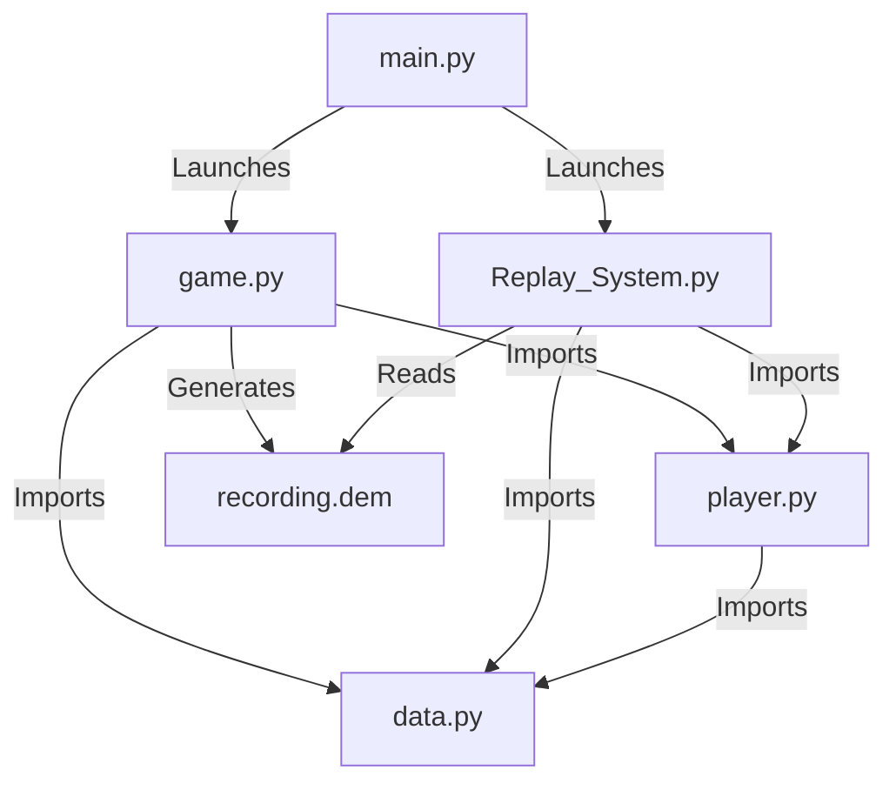
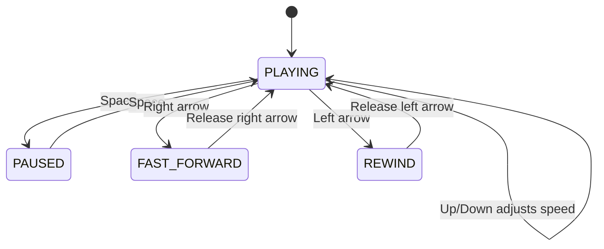
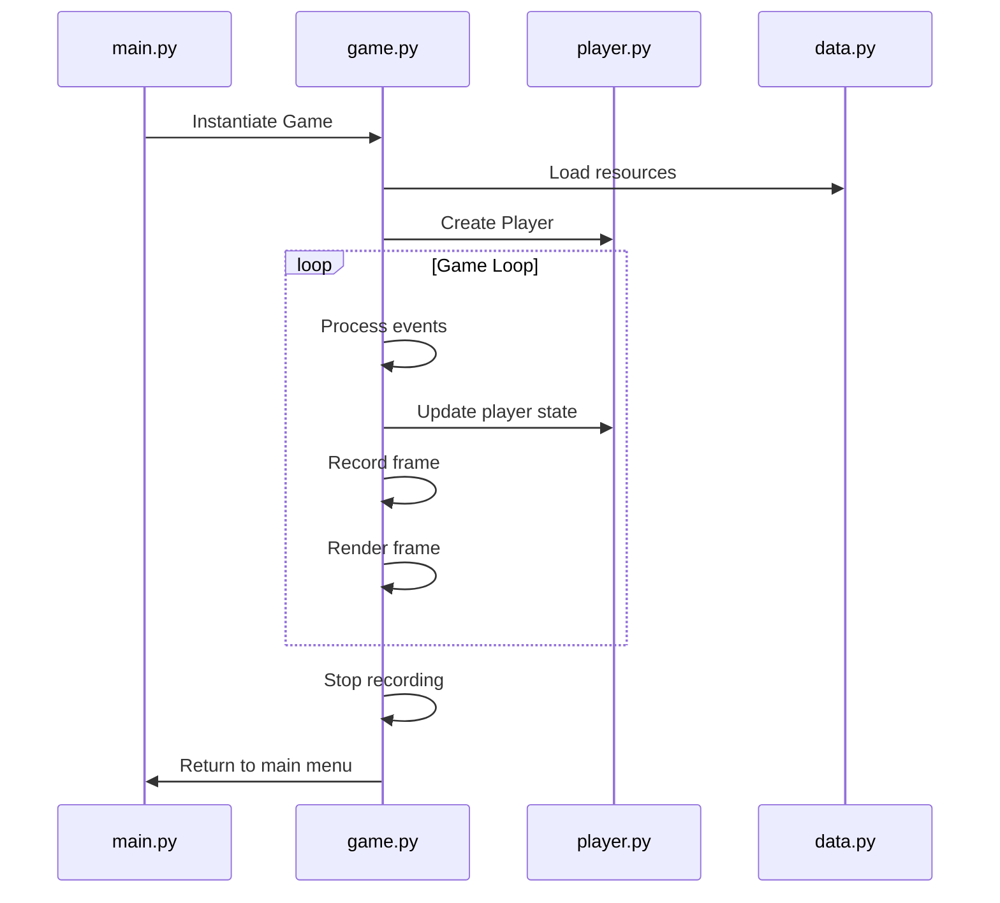
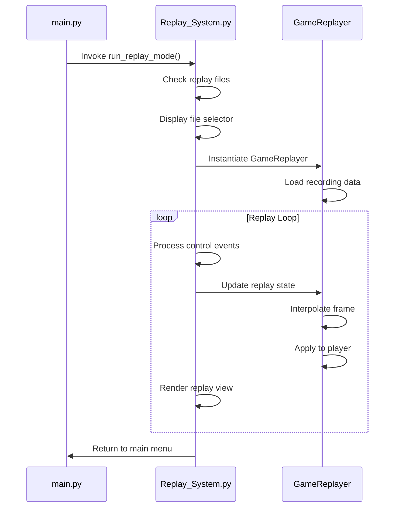

```markdown
# Detailed Analysis Document for 2D Movement Game and Replay System

## File Structure Overview

### 1. data.py - Game Constants & Utility Functions

**Function**: Stores global constants, color definitions, physics parameters, and utility functions

**Constant Definitions**:

```python
# Screen settings
SCREEN_WIDTH, SCREEN_HEIGHT = 1920, 1080

# Color definitions
BACKGROUND = (30, 30, 50)  # Background color
TEXT_COLOR = (220, 220, 255)  # Text color
KEY_PRESSED_COLOR = (0, 255, 0)  # Key press highlight color
INFO_COLOR = (100, 200, 255)  # Information text color
PANEL_COLOR = (40, 40, 60, 200)  # UI panel color (with transparency)

# Movement physics parameters
WALK_SPEED = 250.0  # Base walking speed (pixels/second)
SPRINT_SPEED = 320.0  # Base sprinting speed (pixels/second)
ACCELERATION = 20.0  # Acceleration (pixels/second²)
DECELERATION = 15.0  # Deceleration (pixels/second²)
AIR_ACCELERATION = 10.0  # Air acceleration (unused)
FRICTION = 5.0  # Ground friction coefficient

RECORD_FPS = 64  # Recording frame rate (frames/second)

# Key mapping for monitoring
KEYS_TO_MONITOR = {
    pygame.K_d: "D Key",
    pygame.K_w: "W Key",
    pygame.K_a: "A Key",
    pygame.K_s: "S Key",
    pygame.K_LSHIFT: "Left Shift",
    pygame.K_RSHIFT: "Right Shift",
}
```

**Core Functions**:

1. `load_player_image()`:
   - Attempts to load "player_image.png"
   - Creates blue circle placeholder if loading fails
   - **Returns**: 80x80 pixel Surface object

2. `get_font(size=24)`:
   - Retrieves "simhei" (SimHei) font at specified size
   - **Parameter**: Font size (default 24)
   - **Returns**: pygame.Font object

3. `init_pygame()`:
   - Initializes Pygame and creates screen
   - Sets window title and event filters
   - **Returns**: Screen Surface object

4. `calculate_speed(velocity)`:
   - Calculates magnitude of velocity vector
   - **Parameter**: Velocity vector [vx, vy]
   - **Returns**: Scalar speed value (float)

### 2. player.py - Player Character Implementation

**Function**: Implements player physics and state management

**Player Class**:

```python
class Player:
    def __init__(self):
        # Initial position at screen center
        self.position = [SCREEN_WIDTH / 2.0, SCREEN_HEIGHT / 2.0]
        self.velocity = [0.0, 0.0]  # Velocity vector
        self.sprinting = False  # Sprint state
        self.grounded = True  # Grounded status (always True in 2D)
        self.image = data.load_player_image()  # Player texture
        self.rect = pygame.Rect(0, 0, 80, 80)  # Collision rectangle
```

**Core Methods**:

1. `update(pressed_keys, delta_time)`:
   - **Parameters**:
     - `pressed_keys`: Currently pressed keys
     - `delta_time`: Time elapsed since last frame (seconds)
   - **Functionality**:
     - Detects Shift key for sprint state
     - Calculates desired direction vector from WASD
     - Normalizes direction vector
     - Projects current velocity onto desired direction
     - Applies acceleration limits
     - Applies friction-based deceleration
     - Updates position
     - Updates collision rectangle

2. `check_ground(ground_y)`:
   - Sets grounded=True in 2D environment
   - **Parameter**: Ground Y-coordinate (unused)

3. `check_bounds()`:
   - Ensures player stays within screen boundaries
   - Boundaries: X:[40, SCREEN_WIDTH-40], Y:[40, SCREEN_HEIGHT-40]

4. `draw(screen)`:
   - Renders player texture on screen
   - **Parameter**: Target screen Surface

### 3. game.py - Core Game Logic

**Function**: Manages game loop, states, recording, and rendering

**Game Class**:

```python
class Game:
    def __init__(self, screen):
        self.screen = screen  # Display surface
        self.player = Player()  # Player instance
        self.clock = pygame.time.Clock()  # Game clock
        self.show_detection = False  # Detection panel visibility
        self.last_time = 0.0  # Previous frame timestamp
        self.ground_y = SCREEN_HEIGHT - 100  # Ground plane Y-coordinate
        # Initialize UI elements and background
        self.create_background_grid()
        self.create_ui_elements()
        # Recording attributes
        self.recording = False  # Recording state
        self.record_file = None  # Recording file object
        self.record_start_time = 0  # Recording start time
        self.last_record_time = 0  # Last recorded timestamp
        self.record_interval = 1.0 / RECORD_FPS  # Recording interval
```

**Core Methods**:

1. `start_recording()`:
   - Creates timestamp-named .dem file
   - Writes file header (screen dimensions, FPS, start time)
   - Sets recording state flag

2. `stop_recording()`:
   - Closes recording file
   - Resets recording state

3. `record_frame(player)`:
   - **Parameter**: Current player instance
   - Records frame data at RECORD_FPS frequency:
     - Relative timestamp (seconds)
     - Position (x,y)
     - Velocity (vx,vy)
     - Sprint state (0/1)

4. `update()`:
   - Calculates frame delta time
   - Updates player state
   - Performs boundary checks
   - Records current frame
   - **Returns**: Current key states and delta time

5. `render(pressed_keys, delta_time)`:
   - Renders background, player, UI elements
   - Shows different panels based on show_detection state

### 4. Replay_System.py - Replay System

**Function**: Loads and plays recorded game data

**Enumeration Class**:

```python
class ReplayState(Enum):
    PLAYING = 1  # Normal playback
    PAUSED = 2   # Paused
    FAST_FORWARD = 3  # Fast forward
    REWIND = 4   # Rewind
```

**GameReplayer Class**:

```python
class GameReplayer:
    def __init__(self, filename):
        self.filename = filename  # Replay filename
        self.frames = []  # All frame data storage
        self.current_time = 0.0  # Current playback time
        self.playback_speed = 1.0  # Playback speed multiplier
        self.state = ReplayState.PLAYING  # Current state
        self.start_time = 0  # Recording start time
        self.total_time = 0  # Total duration
        self.player = Player()  # Dedicated replay player
        self.load_recording()  # Load recording data
```

**Core Methods**:

1. `load_recording()`:
   - Parses .dem file
   - Reads header (screen dimensions, start time)
   - Loads frame data into self.frames
   - Calculates total duration

2. `get_frame_at_time(target_time)`:
   - **Parameter**: Target time (seconds)
   - Locates nearest frame using binary search
   - Linearly interpolates intermediate states
   - **Returns**: Interpolated frame data

3. `apply_frame(frame)`:
   - Applies frame data to replay player
   - Sets position, velocity, and sprint state

4. `update(delta_time)`:
   - Updates current time based on state
   - Applies current frame data

5. `run_replay_mode(screen)`:
   - Entry point for replay mode
   - Checks replay files
   - Displays file selection interface
   - Creates replayer and background
   - Handles replay control events
   - Updates and renders replay state

### 5. main.py - Main Menu System

**Function**: Provides game entry and mode selection

**Core Function**:

```python
def main_menu():
    # Initialize Pygame
    screen = pygame.display.set_mode((1920, 1080))
  
    while True:
        # Render menu options
        options = [("Start Game", (0, 100, 200)),
                   ("Replay Game", (0, 150, 200)),
                   ("Exit", (200, 50, 50))]
    
        # Event handling
        if "Start Game" selected:
            game = Game(screen)
            game.run()
        elif "Replay Game" selected:
            run_replay_mode(screen)
        elif "Exit" selected:
            pygame.quit()
            sys.exit()
```

## Inter-File Relationships & Data Flow



### Data Flow Example (Game Recording):

1. `main.py` launches `Game`
2. `Game.run()` initiates main loop
3. Each frame calls `Player.update()` for new position
4. Invokes `Game.record_frame()` to write frame data
5. Generates .dem file when recording ends

### Data Flow Example (Replay):

1. `main.py` launches `run_replay_mode()`
2. Select .dem file to create `GameReplayer`
3. `GameReplayer.load_recording()` parses file
4. During replay loop, calls `get_frame_at_time()`
5. `apply_frame()` updates replay player state
6. Renders player to screen

## Physics System Deep Dive

### Movement Algorithm Pseudocode

```
function update(pressed_keys, delta_time):
    // 1. Determine max speed
    max_speed = sprinting ? SPRINT_SPEED : WALK_SPEED
  
    // 2. Calculate desired direction
    wish_dir = [0, 0]
    if W pressed: wish_dir.y -= 1
    if S pressed: wish_dir.y += 1
    if A pressed: wish_dir.x -= 1
    if D pressed: wish_dir.x += 1
  
    // 3. Normalize direction vector
    if wish_dir length > 0:
        wish_dir = wish_dir / magnitude(wish_dir)
  
    // 4. Calculate velocity projection
    current_speed = dot_product(velocity, wish_dir)
  
    // 5. Apply acceleration
    add_speed = max_speed - current_speed
    if add_speed > 0:
        accel_speed = min(ACCELERATION * max_speed * delta_time, add_speed)
        velocity += wish_dir * accel_speed
  
    // 6. Apply friction
    speed = magnitude(velocity)
    if speed > 0:
        drop = speed * FRICTION * delta_time
        new_speed = max(speed - drop, 0)
        velocity *= new_speed / speed
  
    // 7. Update position
    position += velocity * delta_time
```

### Physics Parameters Reference

| Parameter        | Value | Function                     |
|------------------|-------|------------------------------|
| WALK_SPEED       | 250.0 | Base movement velocity       |
| SPRINT_SPEED     | 320.0 | Sprint velocity              |
| ACCELERATION     | 20.0  | Acceleration coefficient     |
| FRICTION         | 5.0   | Friction coefficient         |
| RECORD_FPS       | 64    | Recording sample rate        |

## Recording File Format Specification

### File Structure

```
SCREEN_WIDTH: 1920
SCREEN_HEIGHT: 1080
RECORD_FPS: 64
START_TIME: 1721345678.901  // Recording start timestamp
[Frame data lines...]
```

### Frame Data Line Format

`Timestamp,PosX,PosY,VelX,VelY,SprintState`

Example:

```
0.000,960.0,540.0,0.0,0.0,0
0.015,961.2,539.8,15.3,-1.2,1
0.031,963.8,538.5,18.7,-2.5,1
```

### Field Descriptions

| Field          | Type  | Description                          |
|----------------|-------|--------------------------------------|
| Timestamp      | float | Time relative to start (seconds)     |
| PosX           | float | Player X-coordinate                  |
| PosY           | float | Player Y-coordinate                  |
| VelX           | float | X-axis velocity                      |
| VelY           | float | Y-axis velocity                      |
| SprintState    | int   | 0=Walking, 1=Sprinting               |

## Replay System Key Technologies

### Temporal Interpolation Algorithm

1. Utilizes bisect module for binary search
2. Locates bracketing keyframes
3. Linear interpolation between states:
   ```python
   ratio = (target_time - prev_time) / (next_time - prev_time)
   pos_x = prev_x + (next_x - prev_x) * ratio
   vel_x = prev_vx + (next_vx - prev_vx) * ratio
   ```

### Playback Control State Machine



### Replay Control Bindings

| Key     | Function      | Implementation                     |
|---------|---------------|-------------------------------------|
| Space   | Play/Pause    | Toggles PLAYING/PAUSED states       |
| →       | Fast Forward  | Sets FAST_FORWARD state             |
| ←       | Rewind        | Sets REWIND state                   |
| ↑       | Speed Up      | playback_speed += 0.5 (max 5.0)     |
| ↓       | Slow Down     | playback_speed -= 0.5 (min 0.1)     |
| J       | Jump          | Enter target time to set current_time |
| ESC     | Exit          | Terminates replay loop              |

## System Interaction Workflows

### Game Mode Sequence



### Replay Mode Sequence



## Extensibility & Optimization Suggestions

### 1. Physics System Expansion

```python
# Add jump functionality
def update(self, pressed_keys, delta_time):
    if self.grounded and pressed_keys[pygame.K_SPACE]:
        self.velocity[1] = -JUMP_FORCE  # Apply upward impulse
        self.grounded = False
```

### 2. Replay System Optimization

```python
# Add keyframe markers
def record_frame(self, player):
    if position_velocity_change > threshold:
        self.record_file.write("KEYFRAME\n")  # Mark keyframe
    
# Utilize keyframes during replay
def get_frame_at_time(self, target_time):
    if nearby_keyframe_exists:
        keyframe_interpolation()  # Enhance precision
```

### 3. Network Synchronization Extension

```python
# Network-synchronized frame format
class NetworkFrame:
    def __init__(self, timestamp, player_states):
        self.timestamp = timestamp
        self.player_states = player_states  # All player states
    
# Network frame recording
def record_network_frame(self):
    frame = NetworkFrame(time.time(), [p.get_state() for p in players])
    self.record_file.write(frame.serialize())
```

### 4. Performance Optimization Guide

1. **Background Caching**: Pre-render static background to Surface
2. **Font Reuse**: Cache frequently used font objects
3. **Frame Pacing**: Use clock.tick() for consistent frame rates
4. **Memory Management**: Limit loaded replay data size
5. **Rotation Optimization**: Implement quaternion interpolation for rotations

## Conclusion

This system delivers a comprehensive 2D movement game framework featuring:

1. **Physical Precision**: Realistic acceleration/friction model
2. **Robust Recording**: High-fidelity state capture
3. **Adaptive Replay**: Variable-speed playback with frame-accurate seeking
4. **Rich UI**: Multi-mode information displays
5. **Modular Clarity**: Well-defined component responsibilities

By extending physics, adding game elements, or optimizing replay algorithms, the system's utility and user experience can be further enhanced for professional-grade applications.